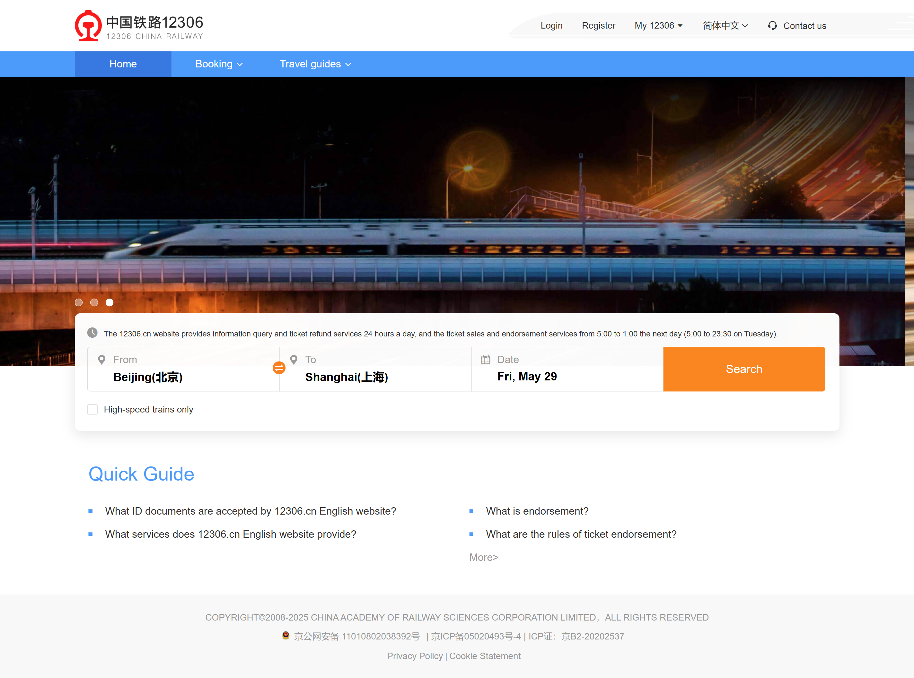
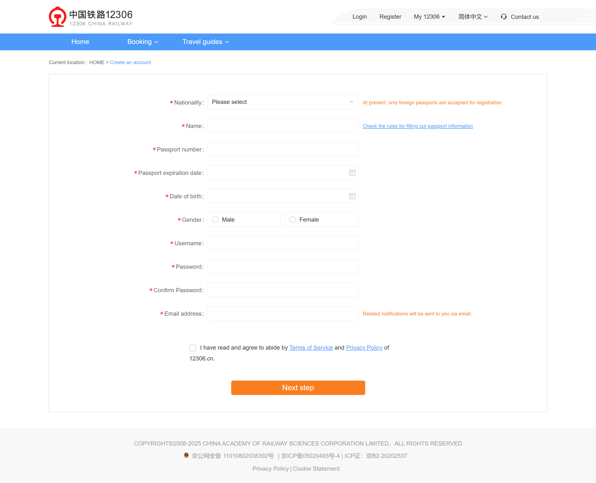
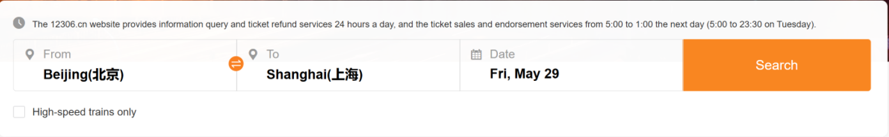
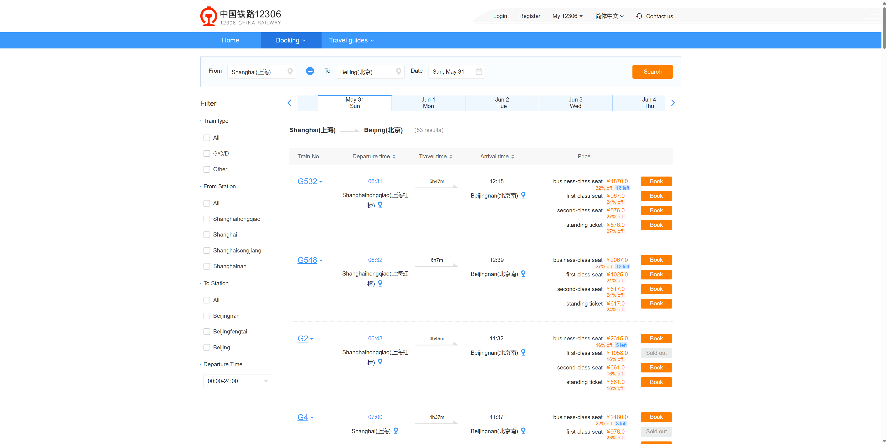
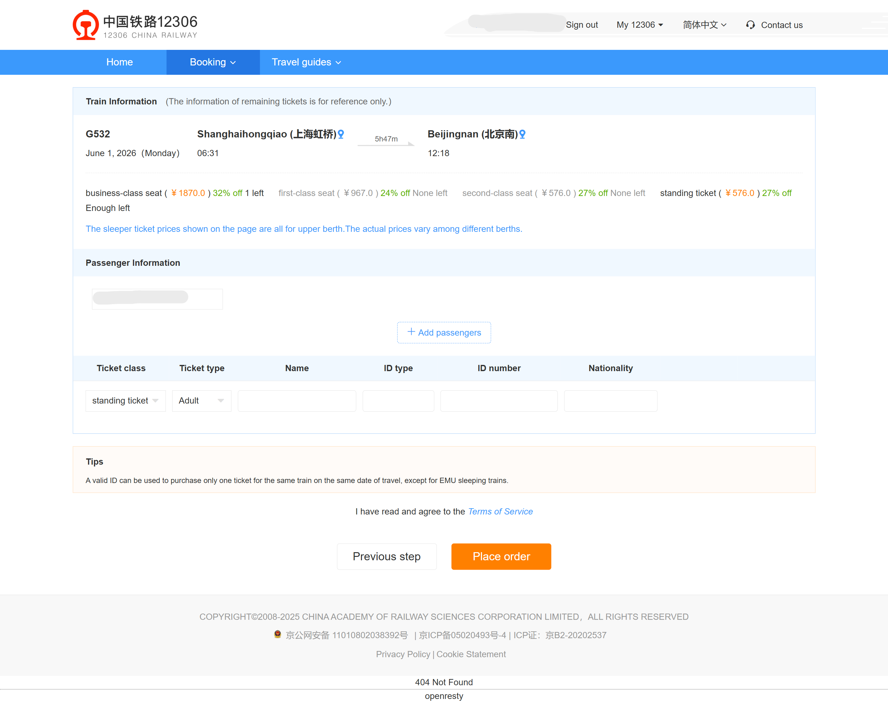

# Small Train Ticket Booking System
A small web-based ticket booking system covering user authentication, train search and result display, and basic booking capabilities.

## REQ-1 Public Homepage and User Authentication
Defines the public homepage, shared navigation, authentication entry points, and session-related public APIs. This node can guide generation of the shared header, route entry points, login/register entry styling, and shared logic for session loading. Optional visual reference: 

**Type:** FOLDER
**Dependencies:** None

### REQ-1.1 User Registration
An unauthenticated visitor can open the registration page, fill in username, email, password, and confirm password, and submit the registration form. The system must validate the input, create and persist a user account, establish a login session, and move the UI into an authenticated state after success. Invalid input or duplicate accounts must return explicit errors and must not create a new user record. Optional visual reference: 

**Type:** ATOMIC
**Dependencies:** None

**Scenarios:**
- Successfully register a new user
  - **GIVEN:** The visitor is on a public page and is currently not logged in.
  - **WHEN:** The user opens the registration page, enters a unique username, a valid email, matching passwords, and submits the form.
  - **THEN:** The system creates and persists the new user, establishes a login session, and moves the UI into an authenticated state.
- Reject duplicate accounts or invalid input
  - **GIVEN:** The visitor is on the registration page, and the username or email already exists, or required fields are incomplete, or the two passwords do not match.
  - **WHEN:** The user submits the registration form.
  - **THEN:** The system returns explicit validation or conflict feedback and does not create a new user record or login session.

### REQ-1.2 User Login
A visitor with an existing account can open the login page and sign in using a username or email plus password. The system must validate credentials, load the persisted user, establish a login session, and move the UI into an authenticated state after success. Invalid credentials must not create a session. Optional visual reference: 

**Type:** ATOMIC
**Dependencies:** REQ-1.1

**Scenarios:**
- Log in with a valid account
  - **GIVEN:** The visitor is on a public page and already has a valid persisted account.
  - **WHEN:** The user opens the login page, enters the correct username or email and password, and submits the form.
  - **THEN:** The system validates the credentials, establishes a session, and moves the UI into an authenticated state.
- Reject invalid login credentials
  - **GIVEN:** The visitor is on the login page but enters a wrong password, wrong account, or incomplete credentials.
  - **WHEN:** The user submits the login form.
  - **THEN:** The system returns authentication failure feedback and does not create a logged-in session.

## REQ-2 Search and Result Display
Defines the homepage search form, result-page list layout, public search query APIs, and the shared data boundary from search criteria to the result page. This node can guide generation of shared UI such as the search bar, result list skeleton, pagination, or result summary areas. Visual reference:  

**Type:** FOLDER
**Dependencies:** None

### REQ-2.1 Submit Search Criteria and Display Train Results
The user can enter departure city, destination city, and departure date on the homepage to start a search. The system must validate the input, execute the train query, return runtime results, and display the submitted search criteria, result count, and matching train list on the result page. Result data must come from the system's own runtime data rather than hardcoded sample content. Optional visual reference:  

**Type:** ATOMIC
**Dependencies:** None

**Scenarios:**
- Search with valid criteria and display results
  - **GIVEN:** The user is on the homepage and has entered a departure city, destination city, and departure date.
  - **WHEN:** The user triggers the search action.
  - **THEN:** The system completes the search and opens the result page, showing the search criteria, result count, and matching train list.
- Block incomplete search input
  - **GIVEN:** The user is on the homepage and at least one required search field is empty.
  - **WHEN:** The user triggers the search action.
  - **THEN:** The system shows explicit validation feedback and does not perform a valid search or navigate to the result page.

### REQ-2.2 Display an Empty Result State
When a valid search matches no trains, the result page must still preserve the user's original search criteria and show a clear empty-result state. The system must not replace the real empty-result feedback with an error, a blank page, or fabricated result rows.

**Type:** ATOMIC
**Dependencies:** REQ-2.1

**Scenarios:**
- A valid search returns no results
  - **GIVEN:** The user submits a valid search, but there are no matching trains in the current database.
  - **WHEN:** The result page is opened.
  - **THEN:** The system preserves the original search criteria and shows a clear empty-result state instead of fabricated result data.

### REQ-2.3 Load the Selected Train from the Result List and Enter the Booking Page
The user can choose a specific train from the search result list and enter the booking page. The system must load the full details of the selected train by its identifier and use it as the current context for the downstream booking flow. Optional visual reference:  

**Type:** ATOMIC
**Dependencies:** REQ-2.1

**Scenarios:**
- Select a specific train from the results and enter the booking page
  - **GIVEN:** The user is viewing the search result list and at least one train is available for booking.
  - **WHEN:** The user clicks the booking entry on a specific train.
  - **THEN:** The system loads the full details of that train and opens the booking page, making it the current booking context.
- Block entry to a booking page for a non-existent train
  - **GIVEN:** The user triggers a booking entry that points to a non-existent or expired train.
  - **WHEN:** The system attempts to load that train's details.
  - **THEN:** The system returns explicit not-bookable feedback rather than opening a booking page with missing context.

## REQ-3 Booking Functionality
Defines the protected booking page, passenger information form, booking submission API, and the confirmation result boundary after a successful booking. This node can guide generation of shared UI such as the booking form skeleton, selected-train summary area, and booking-success message area. Optional visual reference:  

**Type:** FOLDER
**Dependencies:** REQ-1, REQ-2

### REQ-3.1 Load the Booking Page and Display the Selected Train Summary
After a logged-in user enters the booking page, the system must load and display the summary information of the currently selected train. The page must display the train identifier, departure city, destination city, date, and the basic context needed for booking. Optional visual reference: 

**Type:** ATOMIC
**Dependencies:** REQ-1.2, REQ-2.3

**Scenarios:**
- A logged-in user opens the booking page and sees the train summary
  - **GIVEN:** The logged-in user has already selected a specific train from the search results.
  - **WHEN:** The booking page is opened.
  - **THEN:** The system loads the current train context and displays the full train summary so the user can continue filling in booking information.

### REQ-3.2 Submit Passenger Information and Create a Booking Record
A logged-in user can fill in passenger name, ID number, and seat type on the booking page and submit the booking. The system must validate the passenger information, create and persist a booking record that belongs to the current user and is bound to the current train, and return a success result. Invalid input must not create a booking record. Optional visual reference: 

**Type:** ATOMIC
**Dependencies:** REQ-3.1

**Scenarios:**
- Submit valid booking information and create a booking record
  - **GIVEN:** A logged-in user is viewing the booking page for a selected train.
  - **WHEN:** The user enters a valid passenger name, ID number, and seat type, and submits the booking form.
  - **THEN:** The system creates and persists a new booking record and returns a booking-success result to the UI.
- Reject invalid passenger information
  - **GIVEN:** A logged-in user is viewing the booking page, but the passenger name, ID number, or seat type is invalid or missing.
  - **WHEN:** The user submits the booking form.
  - **THEN:** The system returns explicit validation feedback and does not create a new booking record.

### REQ-3.3 Display the Booking Success Result
After a booking record has been created successfully, the system must load the newly created booking record and display a success page or success panel. The page must display the booking number, train summary, passenger summary, and success status rather than only a static success message. Visual reference: 

**Type:** ATOMIC
**Dependencies:** REQ-3.2

**Scenarios:**
- Load the newly created booking record and display the success result
  - **GIVEN:** The current user has just completed a successful booking, and the system has already created the corresponding booking record.
  - **WHEN:** The booking success page or success panel is opened.
  - **THEN:** The system loads and displays the key information of that booking record, including the booking number, train summary, passenger summary, and success status.
